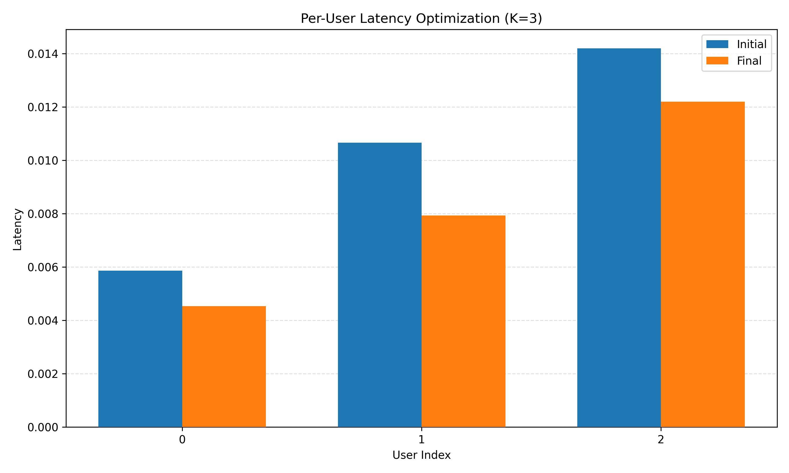
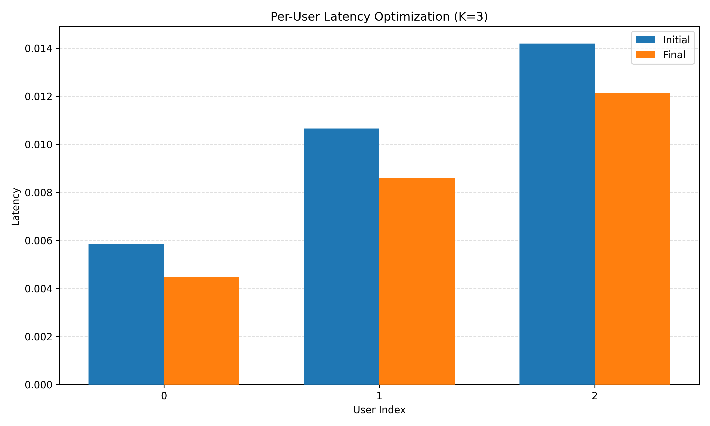
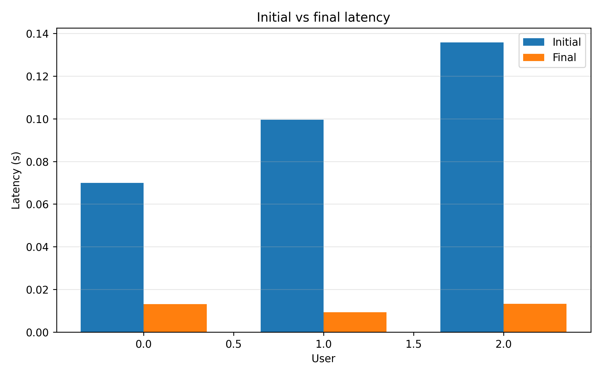
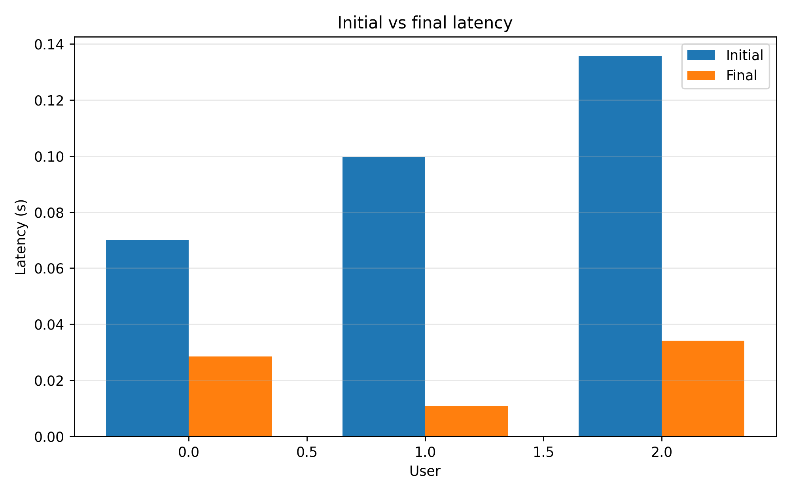

# UL Min Latency: Uplink + Downlink

This repository contains finite-blocklength payload-completion and streaming
experiments for uplink and downlink. The cleaned public suite has two method
families: online convergence and offline Monte Carlo precoder-network training.

Both links use the same scenario definitions, FBL-rate evaluation, result
structure, and `n_kl` search controls. Downlink uses normalized inverse-CNR
weighted sum rate; uplink uses unweighted sum rate.

## Communication Scenarios

- `payload`: `B[k]` is user `k`'s total payload. Served bits are
  removed from the remaining payload until it reaches zero.
- `streaming`: `B[k]` new bits arrive for user `k` in every block for exactly
  `experiment_scenario.number_of_blocks` blocks. Unserved bits are recorded as
  missed bits and are not carried into the next block.

In streaming mode, a block that cannot deliver the complete target uses
`n_kl = T[k]` and sends as many bits as its achieved FBL rate supports. The
next block always starts with a fresh `B[k]` target.

## What Is In This Repository

- `latency_optimization/uplink/`
  - uplink system model, convergence, Monte Carlo, benchmarks, and plotting
- `latency_optimization/downlink/`
  - downlink system model, convergence, Monte Carlo, benchmarks, and plotting
- `latency_optimization/core/`, `experiments/`, and `results/`
  - shared mathematical rules, experiment infrastructure, and result handling
- `configs/experiments/`
  - self-contained payload-completion and streaming experiment YAML files
- `configs/benchmarks/`
  - intentionally small validation-only YAML files
- `configs/batch_runs/`
  - lists of experiment configurations and methods to launch together
- `configs/parameter_guides/`
  - configuration documentation and parameter explanations
- `Results/`
  - saved experiment outputs, plots, summaries, and comparison artifacts
- `docs/figures/`
  - a small set of README-friendly latency figures copied from representative saved runs

## Main Methods

### Convergence per epoch

This is the online training-only baseline. It optimizes a direct complex
precoder or an online precoder network for the current channel.

Run through `python -m latency_optimization run --method convergence` and
select the link with `--link uplink` or `--link downlink`.

### Monte Carlo

This is the offline train-and-test pipeline. Training seeds create channel
episodes, rollout visits `n_kl` states, and the trained network is evaluated on
a held-out seed. There is no expert-beam MSE dataset.

Run through `python -m latency_optimization run --method monte_carlo` and
select the link with `--link uplink` or `--link downlink`.

## Representative Payload-Completion Results

The table below summarizes the saved representative payload-completion runs currently used for the README figures. All latency reductions are reported against the random-precoder baseline stored in the corresponding result summary.

| Link     | Method                | Saved run                        | Initial total latency | Final total latency | Latency reduction |
| -------- | --------------------- | -------------------------------- | ---------------------:| -------------------:| -----------------:|
| Uplink   | Convergence per epoch | `conv_net__payload__s3`          | `0.030733`            | `0.024667`          | `19.7397%`        |
| Uplink   | Monte Carlo           | `mc__payload__s3`                | `0.030733`            | `0.025200`          | `18.0043%`        |
| Downlink | Convergence per epoch | `conv_sum_user_net__payload__s3` | `0.305000`            | `0.035800`          | `88.2623%`        |
| Downlink | Monte Carlo           | `mc_user__payload__s3`           | `0.305000`            | `0.073533`          | `75.8907%`        |

## Latency Gain Over ZF And RZF

The next table compares the saved dispersion-heavy payload-completion convergence runs against the matching ZF and RZF benchmark runs with the same link, scenario, and test seed. The gain is computed from final total latency as:

`gain = (benchmark_final_latency - method_final_latency) / benchmark_final_latency`

Positive values mean the method achieved lower final latency than the benchmark. Negative values mean the benchmark remained better.

| Link     | Method                | Method final latency | ZF final latency | Gain vs ZF | RZF final latency | Gain vs RZF |
| -------- | --------------------- | --------------------:| ----------------:| ----------:| -----------------:| -----------:|
| Uplink   | Convergence per epoch | `0.003533`           | `0.004000`       | `11.68%`   | `0.003933`        | `10.17%`    |
| Downlink | Convergence per epoch | `0.004600`           | `0.008867`       | `48.12%`   | `0.005933`        | `22.47%`    |

## Latency Improvement Figures

### Uplink

| Convergence per epoch                                                                  | Monte Carlo                                                                            |
| -------------------------------------------------------------------------------------- | -------------------------------------------------------------------------------------- |
|  |  |

### Downlink

| Convergence per epoch                                                                      | Monte Carlo                                                                                |
| ------------------------------------------------------------------------------------------ | ------------------------------------------------------------------------------------------ |
|  |  |

## Quick Start

Typical runs use the payload-completion or streaming configs in
`configs/experiments/`. The loaders resolve short configuration names, so the
commands do not require that directory path.

### Uplink convergence

```powershell
python -m latency_optimization run --link uplink --method convergence --cfg_name uplink_dispersion_heavy.yaml --seed 3
```

### Uplink Monte Carlo

```powershell
python -m latency_optimization run --link uplink --method monte_carlo --cfg_name uplink_dispersion_heavy.yaml --num_train_channels 11 --test_seed 3
```

### Downlink convergence

```powershell
python -m latency_optimization run --link downlink --method convergence --cfg_name downlink_dispersion_heavy.yaml --seed 3
```

### Downlink Monte Carlo

```powershell
python -m latency_optimization run --link downlink --method monte_carlo --cfg_name downlink_dispersion_heavy.yaml --num_train_channels 11 --test_seed 3
```

For streaming, replace the config name with `uplink_streaming.yaml` or
`downlink_streaming.yaml`. For example:

```powershell
python -m latency_optimization run --link downlink --method convergence --cfg_name downlink_streaming.yaml --seed 3
```

For streaming Monte Carlo, use `--num_train_blocks` and `--num_test_blocks`;
for payload Monte Carlo, use `--num_train_channels` and
`--num_test_channels`. These options are intentionally scenario-specific.

## Result Layout

Representative outputs are stored under:

- `Results/Uplink/Method-Convergence per epoch/<experiment_name>/`
- `Results/Uplink/Method-Monte Carlo/<experiment_name>/`
- `Results/Downlink/Method-Convergence per epoch/<experiment_name>/`
- `Results/Downlink/Method-Monte Carlo/<experiment_name>/`

Typical contents include:

- `data/result.json`
- `data/summary.txt`
- `latency_asynchronality/`
- `link_quality/`
- `optimization_history/`
- `schedule_details/`
- `interference/` for downlink

Monte Carlo runs also save training-side artifacts such as:

- `training/data/train_artifact.pt`
- `training/data/training_dataset_summary.json`
- `training/data/post_training_summary.json`

## Documentation

- [Code organization and module boundaries](docs/CODE_ORGANIZATION.md)
- [Running individual and batch experiments](docs/RUNNING_EXPERIMENTS.md)
- [Experiment config guide](configs/parameter_guides/PARAMETER_GUIDE.md)
- [Downlink inverse-CNR weighting](configs/parameter_guides/downlink_weighting_modes.md)
- [Uplink exhaustive validator](latency_optimization/uplink/benchmarks/exhaustive_search/README.md)

## Notes

- The README figures are copied from saved result folders into `docs/figures/` so they render on GitHub.
- The displayed result tables are representative saved runs. Update a table and its figures together after rerunning an experiment.
